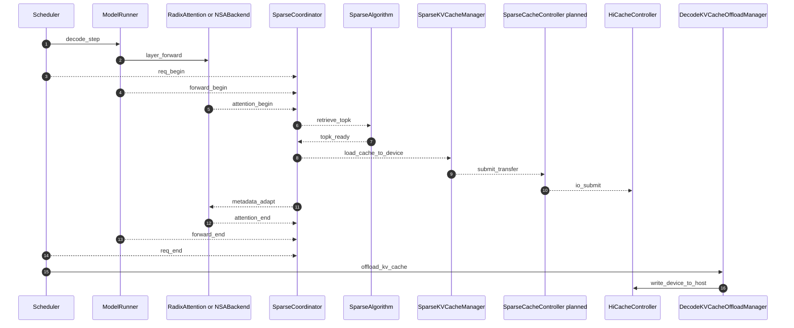

# 基于社区已有的部分 PR 实现 offload

## 1. 背景

我们在论文方面已经提出了可行性分析和实践，但工程上落后开源社区。阿里的开源贡献团队基于 HiCache 已经提出了部分可行骨架，并合入了部分抽象类。本文分析将 kv_offload 贡献至社区需要哪些工作。

## 2. 当前骨架

社区 PR 的目标不是只支持 DeepSeek 的 DSA KV cache offload，而是试图把稀疏化算法都融入 HiCache。当前合入代码主要定义在 `sglang/python/sglang/srt/mem_cache/sparsity`。

![[offload-三层分工.png]]

当前基线缺陷：不支持 MTP、不支持 L3、主流程侵入过多、Decode 写回 L2 频率太低、没有 LRU、不支持 CUDA Graph。

## 3. 第一次尝试

社区可接受的前提：增量开发、尽量把修改放到新文件夹、小步快跑、大 PR 拆小。第一次 PR 目标是最小化改动，让 DeepSeek-V32 offload 能跑起来。

已完成事项包括 CUDA Graph、最小 Triton 映射算子、backend adapter metadata 改写、per-layer D2H、device 侧 KV/index pool 分离、host 侧 layer-first pool。

![[DSA-hicache-新架构.png]]

## 4. Base 与 Community HiSparse 对比

| 维度 | Base | Community |
| --- | --- | --- |
| MTP 适配 | 天然友好，有 draft KV pool 和 draft indexer buffer | 入口互斥，coordinator 按单 token 增量设计 |
| Device buffer | CPU dense + GPU sparse + GPU index 三块独立 buffer | 一块 GPU KV buffer + host KV buffer，indexer 单独一块 |
| Pool 语义 | sparse pool 跨请求共享，容量弹性 | per-request 独占 hot buffer，大小固定 |
| 层内 H2D overlap | hit attention 与 miss H2D 并行 | fused kernel 完成后 attention 才开始 |
| D2H overlap | SetKVCPU 在 trans_stream 上，可和 forward overlap | eager backup 路径相对串行 |
| Kernel launch | 多 kernel，launch cost 高 | 单 fused kernel |
| Miss 策略 | 允许较高 miss，靠 overlap 掩盖 | 需要压低 miss，否则直接加延迟 |

## 5. Base 数据流

Base 把原 GPU KV pool 拆成 CPU dense buffer、GPU sparse buffer、GPU index buffer。P 侧 prefill 完成后发三路数据到 D：dense KV、indexer cache、sparse window。D 侧每层用 indexer top-k 查 hit/miss，miss 通过 `trans_stream` H2D，同时 attention 先算 hit，再 wait event 补 miss。

## 6. Community 数据流

Community 的 `HiSparseNSATokenToKVPool` 给同一块 GPU KV buffer 加地址翻译。P→D 只发 KV cache 和 indexer cache。D 侧先把完整 KV 从 GPU staging 到 host，再收缩成 per-request hot buffer。每层 fused kernel 做 hit/miss 判定、LRU、DMA，返回后再 attention。

## 7. 实测问题

- 单独启动 D 节点测试时出现 token_to_kv_pool_allocator memory leak 提示。
- 32K 长请求触发 illegal memory access。
- fused kernel 在 32K、bs=128、hit=90% 时单层约 0.654ms，端到端约 39.9ms；Decode 前全量备份到 CPU 侧 32K 单 batch 约 110ms。
