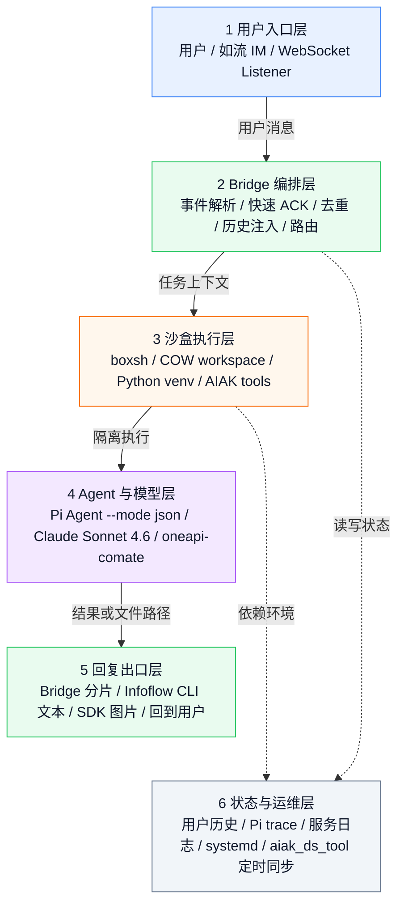

# 【工程】AI Agent 框架应用之百宝箱搭建

# 1. 摘要

我们把 AIAK 百宝箱做成了一个面向如流 IM 的 AI Agent 应用。核心目标不是再做一个聊天机器人，而是把 AIAK infer tools 的算子绘图、性能仿真、数据分析能力封装成可对话、可审计、可运行在沙盒里的工程服务。

当前实现基于四层：如流消息入口、Pi Agent 推理运行时、boxsh 沙盒执行环境、用户级历史与运维保障。用户在如流里发消息，桥接服务接收事件、构造任务上下文、调用 Pi 执行工具，再通过如流 CLI 回复文本，必要时通过 SDK 回复图片。

# 2. 一图流架构



这个图按从上到下的主链路读：用户消息进入如流，Bridge 做编排，boxsh 做隔离执行，Pi 调用模型和工具，最后由 Bridge 通过如流 CLI/SDK 回复用户。状态与运维层是横向支撑，不参与主链路排序。

# 3. 核心工程思路

## 3.1 把 IM 当成应用入口

如流负责用户入口与消息通道。桥接服务只处理三件事：

1. 接收如流 WebSocket 事件。
2. 把事件转换为稳定的任务摘要，包括聊天类型、发送者、文本、引用消息。
3. 把 Agent 输出拆分为如流可接受的文本或图片消息。

文本发送已经切到 `infoflow-cli`，这样后续 Agent 或脚本可以直接复用 CLI，不需要理解 SDK 内部对象。图片发送仍保留 SDK 路径，因为当前 CLI 对私聊图片能力不完整。

## 3.2 把 Agent 当成任务执行器

Bridge 不直接实现复杂业务逻辑，而是构造高约束 prompt 交给 Pi：

- 普通问答：直接回答用户。
- 算子绘图：强约束首个动作走 `aiak_infer_tools plot`。
- 性能仿真：强约束先 dry-run，再正式运行 simulator。
- 文件输出：要求返回绝对路径，便于后续发送图片。

Pi 以 `--mode json` 运行，Bridge 只解析最终 assistant 消息和 trace。这样 Agent 输出可观测，失败时能追踪到完整 JSONL 事件流。

当前底层模型是 `Claude Sonnet 4.6`，通过 Pi 的 Anthropic provider 接到 `https://oneapi-comate.baidu-int.com`。

## 3.3 把执行环境收进沙盒

每次 Agent 调用都通过 `diagnostics/boxsh-runner-command.mjs` 创建隔离会话：

- `aiak_ds_tool` 以 COW workspace 方式挂载。
- Python venv 只读挂载。
- Pi runtime 和 Node 22 只读挂载。
- 运行目录与用户 HOME 隔离。

这样用户可以让 Agent 读数据、跑绘图、跑仿真，但不会直接污染主仓库。主仓库由定时任务同步到 `origin/dev`，保证工具能力持续更新。

## 3.4 把历史做成用户级状态

历史不再存在内存里，而是按用户 ID 落盘到 `logs/user-history/`。这样服务重启后仍能保留上下文。

当前实现是 JSON 文件：

- key：发送者 user id。
- 上限：`INFOFLOW_HISTORY_TURNS`。
- 命令：`/history` 查看近期历史。
- 命令：`/history clear` 清空个人历史。

如果后续要支持多端检索、统计、管理后台，可以迁到 SQLite；但第一阶段 JSON 文件足够简单、可读、可备份。

# 4. 关键可靠性设计

## 4.1 快速 ACK 与重复消息去重

如流会在 ACK 不及时的时候重投消息。实测一条私聊文本可能在几秒内重复投递 3 次。

修复方式：

- WebSocket handler 立即返回，不等待 Pi 执行完成。
- 有平台 `msgKey` 时按 `msgKey` 去重。
- 没有 `msgKey` 的文本按用户、聊天、消息类型、文本内容做 fingerprint，默认 30 秒内去重。

这避免了一句用户问题触发多次 Agent 调用、多次如流回复。

## 4.2 单实例锁

服务启动时获取 `logs/infoflow-bridge.lock`。如果已有活跃 PID，新的 listener 直接失败，避免多个 WebSocket consumer 同时处理同一批消息。

线上由 systemd 管理：

```
aiak-infoflow-bridge.service
```

## 4.3 权限与可观测

一次线上问题显示：`logs/pi-events` 被 root 创建，服务用户无法写 trace，导致回复流程中断。修复后统一目录属主为 `liyanzhen01`。

关键日志：

```
logs/infoflow-bridge.log      服务日志
logs/pi-events/               Pi JSONL trace
logs/user-history/            用户历史
```

# 5. 当前能力清单

- 私聊文本自动回复。
- 群聊文本回复并 @ 提问者。
- 长文本自动分片。
- 图片路径识别与图片发送。
- 用户级历史存取。
- Pi + boxsh 沙盒执行。
- AIAK plot 快速绘图。
- AIAK simulator 性能仿真。
- aiak_ds_tool 每 10 分钟同步 `origin/dev`。
- systemd 常驻与自动重启。

# 6. 运行与排障命令

查看服务：

```bash
systemctl status aiak-infoflow-bridge.service --no-pager
```

重启服务：

```bash
systemctl restart aiak-infoflow-bridge.service
```

查看日志：

```bash
tail -n 200 /home/users/liyanzhen01/PRIVATE/infoflow-claude-bridge/logs/infoflow-bridge.log
```

验证 Pi runner：

```bash
cd /home/users/liyanzhen01/PRIVATE/infoflow-claude-bridge
set -a && . ./.env && set +a
PI_THINKING=off node src/infoflow-claude-bridge.mjs run-agent '只输出 OK'
```

验证如流 CLI：

```bash
infoflow-cli schema list
infoflow-cli im message send-to-user --help
```

# 8. TODO

1. 把用户历史从 JSON 文件迁到 SQLite，支持多条件查询和管理后台。
2. 给如流 CLI 补齐图片能力后，收敛 SDK 发送路径。
3. 增加任务状态消息，例如排队、执行中、生成文件中。
4. 把 plot 和 simulator 的成功率、耗时、错误类型做成指标面板。
5. 增加 Web 端单人私聊入口，复用同一套 Bridge + Pi runner。
6. 针对高耗时任务增加异步任务 ID，用户可查询历史结果。