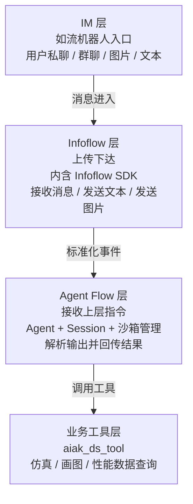
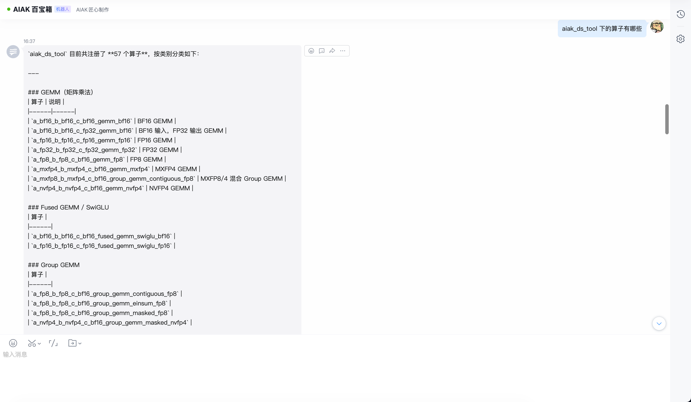
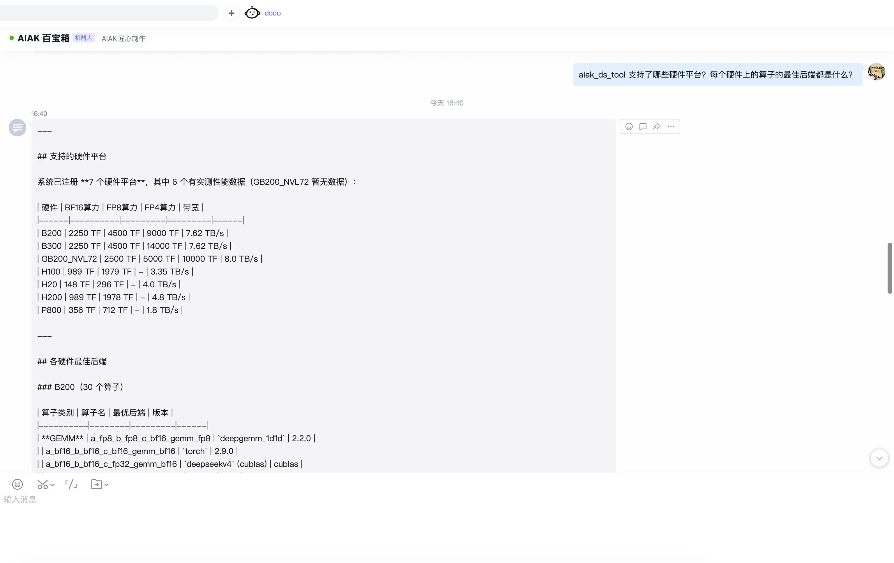
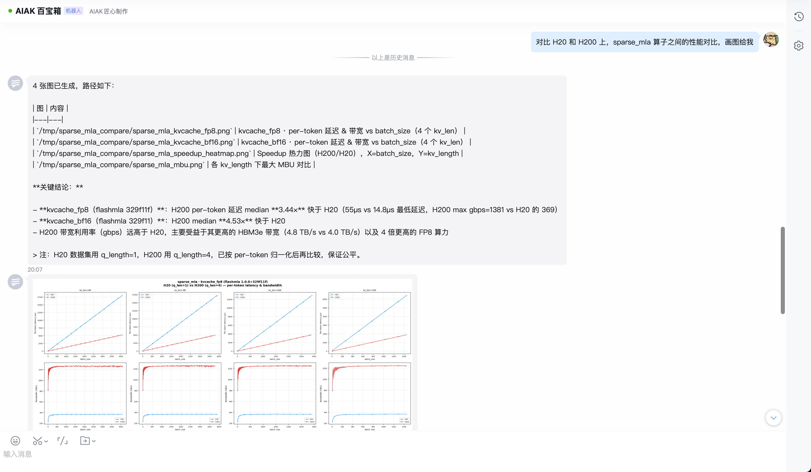
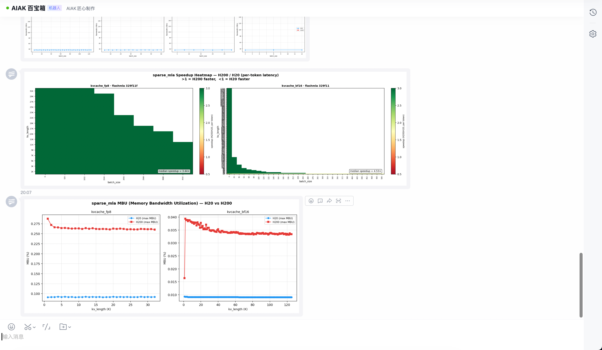

# 【工程】AIAK 百宝箱搭建

---

# 0. 背景

    在 Skill，各路 Agent 卷生卷死的今天，我们为什么还要在公司内部的如流平台上，接入一个新造的轮子 — AIAK 百宝箱（借鉴了千帆百宝箱）？因为我们团队的很多 skill 是面向开发者的，甚至说是特定领域的，比如模拟器仿真吧，虽然已经有 py 的一键脚本了，可是前置的摩擦成本依然很高：比如需要使用者：1. 下载代码到本地；2.到终端执行脚本；3. 大概率第一次还起不来，还需要来回试错加各种参数；4. 打开产生的 CSV 文件，逐个字段的阅读匹配得出最后结论。这么多步骤，都会带来使用者的摩擦，带来体验的不好；而包装成 skill + 如流的团队机器人接口封装后，就可以实现自然语言到脚本执行到拿到结果并自然语言分析的全自动流程化，且可以随时加入如流群聊，为一群人提供类似即插即用的模块化复用能力，也有助于反哺模拟器的需求的快速采集和功能的快速迭代。

# 1.  工程架构

    整体工程架构如下所示：

# 2. 当前效果

# 3. TODO 列表

## 3.1 IM层

- [ ]  上下文轮数限制
- [ ]  AT 人
- [ ]  引用消息实现
- [ ]  并发控制/提示
- [ ]  MD 格式优化

## 3.2 调度层

- [ ]  沙盒管理/清理
- [x]  定时任务，包括不限于 git 仓库更新等

## 3.3 Agent层

- [x]  模型选择/claude code 配置优化
- [x]  优化执行速度

## 3.4 业务层

- [ ]  模拟器 skill 打磨，需要应对模糊的自然语言
- [ ]  画图展示等需加快速度