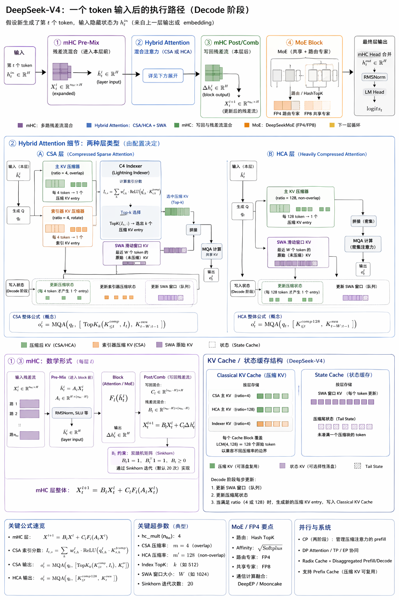
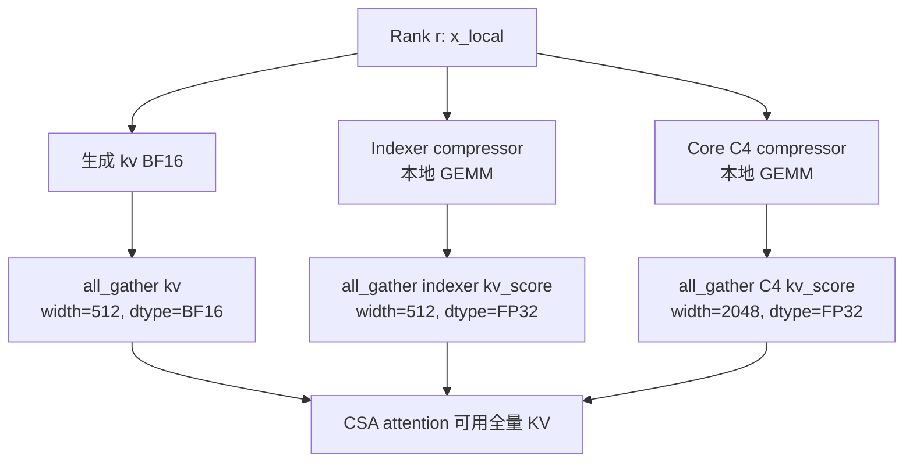
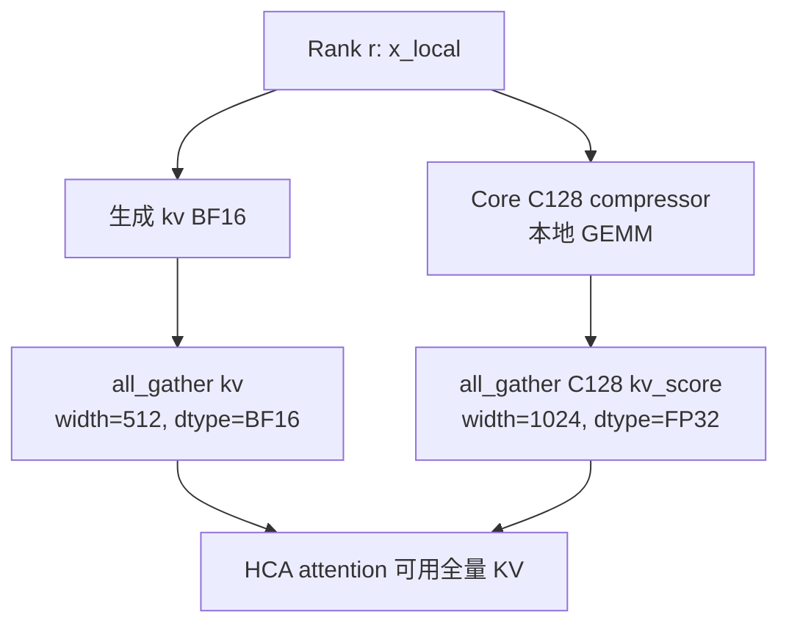

# 【学习】DS-V4 分析&学习

# 0. 摘要

首先给出一图流进行学习，重点都突出在下面了



.jpg)

# 1. 理论重点：Attention 的变化

这次新模型发布，可以看出，DS 为了应对 1M 超长上下文不爆显存，下了很大的功夫。借鉴了类似《[MSA: Memory Sparse Attention for Efficient End-to-End Memory Model Scaling to 100M Tokens](https://www.alphaxiv.org/private/overview/daacc360-03b6-493c-a01e-c1fcfb077f1f)》 这篇恒大团队的思想：很多时候，超长上下文下，某几个 token 的重要程度较低，既然如此，将这么 M 个 token 聚合起来，视作一个 token，不就得了？（ps，CNN 时代的古法炼丹思想还在追我）。

但是，不同于之前这篇论文，它没有把长上下文问题完全改造成一个外部 memory / document routing 系统，而是直接在 Transformer block 内部重构了 Attention、KV Cache 和推理时的数据布局。换句话说，DeepSeek-V4 仍然长得像一个 Transformer，但它内部已经不是传统的 token-level dense attention 了。

DeepSeek-V4 的 Attention 不再让每个 query token 直接 attend 到所有历史 token，而是先把历史 token 压缩成更少的 KV entry，再根据层类型选择“稀疏看一部分”或者“密集看压缩后的全部”。论文里把这个叫做 **Hybrid Attention with CSA and HCA**：

- **CSA：Compressed Sparse Attention**。每 `m` 个 token 压成 1 个 compressed KV entry，然后再通过 indexer 选 top-k 个 compressed entry 做 attention。
- **HCA：Heavily Compressed Attention**。每 `m'` 个 token 压成 1 个 compressed KV entry，`m' >> m`，但压缩后不做 sparse top-k，而是 dense attention over compressed KV。

这比单纯的 sparse attention 更复杂，也比单纯的 KV compression 更激进。它是 compression、sparse selection、sliding window、MQA 和低精度 indexer 的组合拳。

## 1.1 普通 Attention 的瓶颈

普通 self-attention 大概是这样：

```python
# x: [seq_len, hidden]
q = x @ Wq
k = x @ Wk
v = x @ Wv

score = q @ k.T / math.sqrt(head_dim)      # [seq_len, seq_len]
prob = torch.softmax(score, dim=-1)
out = prob @ v
```

在 decode 阶段，虽然每次只生成一个 token，但这个 token 仍然要和所有历史 KV 做 dot product：

```python
# decode one token
q_t = h_t @ Wq                  # [head_dim]
score_t = q_t @ K_cache.T       # [past_len]
out_t = torch.softmax(score_t, dim=-1) @ V_cache
```

当 `past_len = 1M` 时，这个操作就非常恐怖了。注意，这里不只是算力问题，还有显存问题：每个历史 token 都要存 K/V。

MSA 这类工作也是在解决类似问题。它的思路更像是把长上下文组织成可检索的 memory/document 结构，通过 memory sparse attention、document-wise RoPE、KV cache compression 和 memory parallel 去支撑更长上下文。DeepSeek-V4 的路线更贴近标准 Transformer：它没有把模型外部化成一个 memory system，而是在 Attention 层内部直接改变 KV 的表示方式。

## 1.2 CSA：先压缩，再稀疏选择

CSA 的核心路径是：

```
Token-level KV
  -> 每 m 个 token 压成 1 个 compressed KV
  -> Lightning Indexer 给 compressed KV 打分
  -> 选 top-k
  -> query 只 attend 到这 k 个 compressed KV + sliding window KV
```

用最基础的 torch 逻辑写，压缩过程可以理解为：

```python
def compress_kv(x, W_kv, W_z, block_size):
    """
    x: [seq_len, hidden]
    返回 compressed_kv: [seq_len // block_size, head_dim]
    """
    C = x @ W_kv       # [seq_len, head_dim]，被压缩的 KV 内容
    Z = x @ W_z        # [seq_len, head_dim]，压缩权重 logits

    chunks_C = C.view(-1, block_size, C.shape[-1])
    chunks_Z = Z.view(-1, block_size, Z.shape[-1])

    weight = torch.softmax(chunks_Z, dim=1)      # block 内加权
    compressed = (weight * chunks_C).sum(dim=1)  # [num_blocks, head_dim]
    return compressed
```

这里不是简单平均池化，而是**带权压缩**。每个 block 内哪些 token 更重要，不是手写规则决定，而是由模型参数 `W_z` 学出来。

然后是 indexer：

```python
def csa_attention_one_token(h_t, compressed_kv, Wq, Wiq, Ww, topk):
    """
    h_t: 当前 token hidden
    compressed_kv: [num_blocks, head_dim]
    """
    q = h_t @ Wq                 # core attention query
    q_index = h_t @ Wiq          # indexer query
    w = h_t @ Ww                 # indexer head weight，这里简化成标量/向量

    # 实际实现里有多 index head + ReLU + weighted sum
    score = torch.relu(compressed_kv @ q_index) * w

    selected_idx = torch.topk(score, k=topk).indices
    selected_kv = compressed_kv[selected_idx]

    attn_score = q @ selected_kv.T
    prob = torch.softmax(attn_score, dim=-1)

    # DeepSeek-V4 这里是 shared key-value MQA，key/value 都来自 compressed KV
    out = prob @ selected_kv
    return out
```

论文里的 Lightning Indexer 本质上就是：

```python
score = sum_h w_h * relu(q_index_h @ k_index_h)
topk_idx = topk(score)
```

它和传统 attention 的区别是：传统 attention 是直接对所有 token KV 算最终 attention；CSA 是先用轻量 indexer 找“可能有用的 compressed block”，然后只对这些候选块做 core attention。

这个思想可以类比数据库：「先用粗索引找候选行，再对候选行做精确计算」

类似的 sparse selection 思想在 SpAtten、NSA、Longformer、BigBird 等工作里都能看到影子。区别是 DeepSeek-V4 把它和 KV compression、MQA、FP4 indexer、SWA 组合到了一个大模型推理系统里。

## 1.3 CSA 的 overlap compression

CSA 还有一个细节：它不是简单地每 `m` 个 token 切一块，然后完全独立压缩。论文里 CSA 使用两组 KV entry：`Ca/Cb` 和对应的 `Za/Zb`，一个 compressed entry 实际会看相邻的 `2m` 个位置，其中前后 block 有 overlap。

非严格还原，表达 overlap 思想可以写成：

```python
# 非严格还原，只表达 overlap compression 的直觉
block_now = x[i * m : (i + 1) * m]
block_prev = x[(i - 1) * m : i * m]

candidate = torch.cat([block_prev, block_now], dim=0)  # [2m, hidden]
compressed_i = weighted_compress(candidate)
```

这样做的好处是 block 边界更平滑。否则 token 被硬切 block 后，边界附近的信息很容易被割裂。

工程代价是 decode 更麻烦：不是简单 `seq_len % m` 就能判断 tail state，CSA 的 overlap 会让 cache state 维护更复杂。

## 1.4 HCA：更激进压缩，但不稀疏

HCA 可以理解成 CSA 的另一个极端：

```
CSA: 每 4 个 token -> 1 个 compressed KV，然后 top-k sparse attention
HCA: 每 128 个 token -> 1 个 compressed KV，然后 dense attention over compressed KV
```

torch 逻辑非常直观：

```python
compressed_kv = compress_kv(x, W_kv, W_z, block_size=128)

q_t = h_t @ Wq
score = q_t @ compressed_kv.T
prob = torch.softmax(score, dim=-1)
out = prob @ compressed_kv
```

HCA 不做 top-k，因为它已经把序列长度压得很短了。如果原始上下文是 `1M` token，`m'=128` 后只剩大约 `8192` 个 compressed KV entry。对 8192 做 dense attention，比对 1M 原始 token 做 dense attention 便宜太多。

它的损失也很明显：压缩太狠，细粒度信息会被折叠掉。因此 V4 又补了一条 **Sliding Window Attention**。

## 1.5 Sliding Window Attention：补局部信息

CSA/HCA 都有一个共同问题：query token 通常很依赖最近几个 token 的精确信息，而这些信息如果被压进 compressed KV，就会变糊。

所以 V4 在 CSA/HCA 旁边都加了 sliding window KV：

```python
recent_k = K_cache[-window_size:]
recent_v = V_cache[-window_size:]

# CSA/HCA 的 compressed context
compressed_ctx = selected_or_all_compressed_kv

all_k = torch.cat([compressed_ctx, recent_k], dim=0)
all_v = torch.cat([compressed_ctx, recent_v], dim=0)

score = q_t @ all_k.T
out = torch.softmax(score, dim=-1) @ all_v
```

这个设计很合理：远处信息用压缩表示，近处信息用原始 token-level KV 表示。类比人读长文档：很久之前的内容只记概要，刚刚读过的几句话保留原文细节。

# 2. 工程重点：KV Cache 的变化

[shadowradix-notion.html](../资源/shadowradix-notion.html)

这一节要先纠正一个容易误解的点：DeepSeek-V4 不是“运行时自由选择 CSA 或 HCA”。**CSA / HCA 是写在模型 config 里的，每一层使用哪种 attention 是固定的**。SGLang 读取 Hugging Face config 里的 `compress_ratios` 后，按 layer id 构造对应的 attention。

```python
compress_ratio = config.compress_ratios[layer_id]

if compress_ratio == 0:
    # SWA-only，不产生 compressed KV
    attn = SlidingWindowAttention(...)
elif compress_ratio == 4:
    # CSA：c4 compressed KV + indexer + SWA
    attn = CSAAttention(...)
elif compress_ratio == 128:
    # HCA：c128 compressed KV + SWA
    attn = HCAAttention(...)
```

它的语义可以概括成：

```
compress_ratio = 0    -> no compressed attention，只保留 sliding window KV
compress_ratio = 4    -> CSA / c4，每 4 个 token 形成 compressed KV，并且需要 indexer
compress_ratio = 128  -> HCA / c128，每 128 个 token 形成 compressed KV，不需要 indexer
```

所以后面看 KV cache 时，要把两件事分开：

```
单层视角：某一层只消费一种 cache 形态；
全模型视角：模型里同时存在 CSA 层和 HCA 层，所以全局 runtime 必须同时支持 c4 / c128 / SWA / state。
```

## 2.1 HF config 里的真实 layer pattern

根据 Hugging Face 上的 config中的信息，这里最关键的是 `compress_ratios`，它直接决定每一层的 attention 模式。

**DeepSeek-V4-Pro** 主干是 61 层，最后还有 1 个 NextN / MTP 层。pattern 是：

```
Layer 0:  HCA / c128
Layer 1:  HCA / c128
Layer 2:  CSA / c4
Layer 3:  HCA / c128
Layer 4:  CSA / c4
Layer 5:  HCA / c128
...
Layer 60: CSA / c4

MTP layer 61: ratio = 0
```

也就是：

```
HCA / c128: layer 0, 1, 3, 5, ..., 59，共 31 层
CSA / c4:   layer 2, 4, 6, ..., 60，共 30 层
MTP:        layer 61，ratio = 0
```

**DeepSeek-V4-Flash** 主干是 43 层，最后也有 1 个 NextN / MTP 层。pattern 是：

```
Layer 0:  SWA-only / no compression
Layer 1:  SWA-only / no compression
Layer 2:  CSA / c4
Layer 3:  HCA / c128
Layer 4:  CSA / c4
Layer 5:  HCA / c128
...
Layer 42: CSA / c4

MTP layer 43: ratio = 0
```

也就是：

```
SWA-only:   layer 0, 1，共 2 层
CSA / c4:   layer 2, 4, 6, ..., 42，共 21 层
HCA / c128: layer 3, 5, 7, ..., 41，共 20 层
MTP:        layer 43，ratio = 0
```

这个 pattern 很重要：**不是所有层都存两种 cache。单层只维护自己需要的 cache；但是全模型同时有 CSA 层和 HCA 层，所以全局 runtime 同时需要 c4 / c128 两套 compressed cache 能力。**

## 2.2 SGLang 里为了 KV Cache 做了哪些对应改动？

SGLang 这次不是只加一个 `deepseek_v4.py`。它还要让 scheduler、memory pool、radix cache、metadata、attention backend 都理解 V4 的 cache 形态。

核心文件可以粗略分成几组：

```
models/deepseek_v4.py
  根据 config.compress_ratios[layer_id] 构造每层 attention

configs/deepseek_v4.py
  读取 HF config，包括 compress_ratios、sliding_window、index_topk 等

layers/attention/compressed/*
  compressor、indexer、paged prefill、metadata

mem_cache/deepseekv4_memory_pool.py
  V4 专用 KV memory pool

mem_cache/compress_state.py
  c4 / c128 compressor state

mem_cache/swa_memory_pool.py
mem_cache/swa_radix_cache.py
  sliding window KV 和 prefix cache 复用

mem_cache/hisparse_memory_pool.py
  KV cache offload / DRAM-GPU working set 管理
```

一句话总结：V4 的 cache 复杂，不是因为某一层同时跑 CSA 和 HCA，而是因为**全模型层间混合了多种 attention cache 形态，同时 prefill / decode / offload / prefix cache / MTP 都要共享同一套状态语义**。

# 3. 训练重点：mHC 的引入

mHC 这块一笔带过即可。它不是 V4 长上下文效率的主因，更像是模型能力和训练稳定性的结构增强。

普通 Transformer residual 是：

```python
x = x + attention(norm(x))
x = x + mlp(norm(x))
```

mHC 改成了多路 residual stream。用 torch 写一个极简版：

```python
def sinkhorn(B, iters=20):
    B = torch.exp(B)  # 保证非负
    for _ in range(iters):
        B = B / B.sum(dim=0, keepdim=True)  # column normalize
        B = B / B.sum(dim=1, keepdim=True)  # row normalize
    return B

def mhc_layer(X, block, A_raw, B_raw, C_raw):
    """
    X: [n_hc, hidden]
    """
    A = torch.sigmoid(A_raw)          # [1, n_hc]
    C = 2 * torch.sigmoid(C_raw)      # [n_hc, 1]
    B = sinkhorn(B_raw, iters=20)     # [n_hc, n_hc]

    x_in = A @ X                      # [1, hidden]
    delta = block(x_in)               # [1, hidden]

    X_next = B @ X + C @ delta        # [n_hc, hidden]
    return X_next
```

这东西的工程影响比概念影响更大：引入 mHC 后，decoder 内部 hidden state 不再总是 `[num_tokens, hidden]`，而可能是 `[num_tokens, n_hc, hidden]`。Attention/MoE 前要 pre-mix，block 后要 post/comb mix，最后输出 logits 前还要把多路 residual 合回普通 hidden。

所以对理解 V4 长上下文来说，**mHC 是加强 residual connection 的结构升级，并不是 KV cache 降显存的核心手段。**

# 4. 工程上的 Trick 总结 （持续更新）

DeepSeek-V4 的论文和 SGLang PR 里有很多工程优化。这里不逐个铺开，只抓几个和推理系统最相关的。

## 4.1 MoE 专家权重引入 FP4

DeepSeek-V4 仍然沿用 DeepSeekMoE，但 routed experts 使用 FP4。MoE expert weights 是显存大头。MoE 的参数总量巨大，但每个 token 只激活少量专家。推理时真正的问题不是“所有专家都算一遍”，而是专家权重本身要放在显存里，且路由后要高效读取。

把 routed expert 从 FP8/BF16 进一步压到 FP4，可以显著降低权重加载压力。

极简理解：

```python
# 原始专家权重
W_fp32 = expert.weight

# QAT / inference 中转成 FP4 存储
W_fp4, scale = quantize_to_fp4(W_fp32)

# 计算时 dequant 到 FP8/BF16 参与 GEMM
W_compute = dequantize(W_fp4, scale)
out = x @ W_compute
```

实际高性能实现不会真的把 `W_compute` 显式展开出来，而是在 kernel 内完成 load + dequant + GEMM，避免额外显存访问。

<aside>

权重拆分：这里会有一个误区，直接拿全部权重大小均分 8，就是每个卡的显存占用，实际上并不是的

</aside>

### 单个 routed expert

配置：

```
hidden_size = 7168
moe_intermediate_size = 3072
FP4 packed weight = 0.5 byte / param
F8_E8M0 scale = 1 byte / 32 params
effective = 0.53125 byte / logical param
```

| Tensor | 逻辑形状 | HF 存储形状 | weight dtype | scale dtype | weight 大小 | scale 大小 | 合计 |
| --- | --- | --- | --- | --- | --- | --- | --- |
| `w1` | `[3072, 7168]` | `[3072, 3584]` | `I8` packed FP4 | `F8_E8M0` | 11.01 MB | 0.688 MB | 11.70 MB |
| `w2` | `[7168, 3072]` | `[7168, 1536]` | `I8` packed FP4 | `F8_E8M0` | 11.01 MB | 0.688 MB | 11.70 MB |
| `w3` | `[3072, 7168]` | `[3072, 3584]` | `I8` packed FP4 | `F8_E8M0` | 11.01 MB | 0.688 MB | 11.70 MB |
| **单 expert 合计** | `66.06M params` | — | — | — | **33.03 MB** | **2.06 MB** | **35.09 MB / 33.47 MiB** |

单 expert 公式：

```
3 × 7168 × 3072 × (0.5 + 1/32)
= 35,094,528 bytes
= 35.09 MB
= 33.47 MiB
```

### 全模型权重拆分

这里按 **62 个 MoE block** 计算：`61` 个主层 + `1` 个 MTP layer。

| 部分 | 计算口径 | GiB | 占总权重 |
| --- | --- | --- | --- |
| **MoE routed experts** | `62 × 384 × 3 × 7168 × 3072 × 0.53125 byte` | **778.15 GiB** | **96.63%** |
| MoE shared experts | shared expert FFN，主要 FP8 | 3.82 GiB | 0.47% |
| MoE router / gate | router projection / gating weights | 0.33 GiB | 0.04% |
| **MoE 合计** | routed + shared + gate | **782.29 GiB** | **97.14%** |
| Attention core | Q/KV/O 相关主投影 | 17.31 GiB | 2.15% |
| Attention compressor / indexer | hybrid attention 相关压缩与索引权重 | 1.83 GiB | 0.23% |
| **Attention 合计** | core + compressor/indexer | **19.15 GiB** | **2.38%** |
| Embedding / LM head / norm / HC / 其他 | 非 MoE、非 Attention 权重 | 3.86 GiB | 0.48% |
| **总计** | checkpoint 静态权重估算 | **805.31 GiB** | **100%** |

### 8 卡下 routed expert 的静态下限

如果采用官方示例里的 `MP=8`，routed experts 通常按 expert id 分到 8 张卡：

```
384 experts / 8 = 48 experts per rank
```

| 项目 | GiB / card | 口径 / 说明 | 计算公式 |
| --- | --- | --- | --- |
| 计算口径 | — | **TP8 / EP8；routed experts 按 expert 切分；Attention、shared expert、router、HC、embedding、lm_head 等非-routed 权重按每卡复制口径计算；单位为 GiB** | `GiB = bytes / 2^30` |
| 单个 routed expert | **0.032684** | 一个 expert 的 `w1/w2/w3`；FP4 packed weight + FP8_E8M0 scale | `3 * 7168 * 3072 * (1/2 + 1/32) / 2^30` |
| 单层本卡 routed experts | **1.568848** | EP8 下每卡 `384/8=48` 个 routed experts | `48 * 单个 routed expert` |
| 61 层 routed experts | **95.699707** | target model 主体 61 层 | `61 * 48 * 3 * 7168 * 3072 * 17/32 / 2^30` |
| 61 层 shared experts | **3.753159** | 每层 1 个 shared expert，按复制到每卡算，FP8 weight + FP8 scale | `61 * [3*7168*3072 + 3*ceil(3072/128)*ceil(7168/128)] / 2^30` |
| 61 层 router / gate | **0.321496** | gate weight BF16；前 3 层 hash routing 有 `tid2eid`；后 58 层有 bias | `[61*(384*7168*2) + 3*(129280*6*4) + 58*(384*4)] / 2^30` |
| 61 层 attention core | **17.04** | Attention 不切分，`wq_a/q_norm/wq_b/wkv/kv_norm/wo_a/wo_b/attn_sink` 全量复制 | `61 * AttnCoreFull / 2^30`，其中 `AttnCoreFull = FP8(1536,7168)+FP32(1536)+FP8(65536,1536)+FP8(512,7168)+FP32(512)+FP8(16384,4096)+FP8(7168,16384)+128*4` |
| 61 层 compressor | **1.252225** | 非-routed，按复制到每卡算；前 61 层里 `31` 层 ratio=128，`30` 层 ratio=4 | `(31*C128 + 30*C4) / 2^30`，其中 `C128=BF16[128,512]+2*BF16(512,7168)+FP(512)`，`C4=FP32[4,1024]+2*BF16(1024,7168)+FP32(512)` |
| 61 层 indexer | **0.582397** | 只在 `compress_ratio=4` 的 30 层存在；按不切分复制口径 | `30 * I4Full / 2^30`，其中 `I4Full=FP8(8192,1536)+FP8(64,7168)+Compressor(ratio=4, head_dim=128)` |
| 61 层 HC | **0.313184** | block 内 `hc_attn/hc_ffn` + 顶层 `hc_head`，FP32，复制到每卡 | `[61*(2*24*(4*7168)*4 + 2*24*4 + 2*3*4) + (4*(4*7168)*4 + 4*4 + 1*4)] / 2^30` |
| 61 层 RMSNorm | **0.003284** | 每层 `attn_norm/ffn_norm`，外加 final norm，FP32 | `[61*(2*7168*4) + 7168*4] / 2^30` |
| embedding | **1.726074** | 按每卡复制口径，BF16 | `(129280 * 7168 * 2) / 2^30` |
| lm_head | **1.726074** | 按每卡复制口径，BF16 | `(129280 * 7168 * 2) / 2^30` |
| **target model 61 层纯权重合计** | **122.4** | 距离观测到的 `129.3G / rank` 还有几个 G 的差距 |  |
| MTP routed experts | **1.568848** | MTP 额外 1 层 routed experts，EP8 切分 | `48 * 3 * 7168 * 3072 * 17/32 / 2^30` |
| MTP shared expert | **0.061527** | MTP 额外 1 层 shared expert，复制到每卡 | `[3*7168*3072 + 3*ceil(3072/128)*ceil(7168/128)] / 2^30` |
| MTP router / gate | **0.005128** | MTP layer_id=61，非 hash 层，有 gate weight + bias | `[(384*7168*2) + 384*4] / 2^30` |
| MTP attention core | **0.341818** | MTP 的 `compress_ratio=0`，只算不切分 attention core | `AttnCoreFull / 2^30` |
| MTP HC | **0.005554** | MTPBlock 继承 Block 的 HC，再额外有自己的 `hc_head` | `[(2*24*(4*7168)*4 + 2*24*4 + 2*3*4) + (4*(4*7168)*4 + 4*4 + 1*4)] / 2^30` |
| MTP norms | **0.000134** | MTPBlock 中 block 两个 norm + `enorm/hnorm/norm` 三个 norm | `(5 * 7168 * 4) / 2^30` |
| MTP `e_proj + h_proj` | **0.095709** | 两个 FP8 `Linear(7168,7168)` | `2 * [7168*7168 + ceil(7168/128)^2] / 2^30` |
| **MTP 纯权重合计** | **2.078718** | 不重复算 embedding / lm_head，因为 MTP 复用主模型的 embed/head | `1.568848 + 0.061527 + 0.005128 + 0.341818 + 0.005554 + 0.000134 + 0.095709` |
| **MTP 带独立的词表** | **5.51** | **重复算词表** |  |
| **target + MTP 纯权重合计** | **131.482609** | 按非-routed 复制口径的整套纯权重 / card | `129.403891 + 2.078718` |

### 注意：GB 和 GiB 转换

| 单位 | 定义 | 常见场景 |
| --- | --- | --- |
| `GB` | `1 GB = 10^9 bytes` | Hugging Face 文件大小、磁盘厂商标称 |
| `GiB` | `1 GiB = 2^30 bytes = 1,073,741,824 bytes` | `nvidia-smi`、大多数显存/内存工具口径更接近这个 |

## 4.2 CSA indexer 也要低精度

CSA 的 indexer 是每个 decode token 都会触发的路径：

```
当前 query
  -> 和大量 compressed indexer KV 算 score
  -> top-k
```

如果 context 很长，哪怕已经 compressed，indexer 仍然是热点。所以 V4 把 indexer QK path 也做了低精度优化。

```python
q_index_fp4 = quantize_to_fp4(q_index)
k_index_fp4 = quantize_to_fp4(k_index_cache)

score = fp4_dot(q_index_fp4, k_index_fp4)
topk_idx = torch.topk(score, k)
```

这个点很关键：CSA 的收益不能只看最终 MQA 省了多少，indexer 本身也必须足够便宜。否则就会出现“省掉了主 attention，但多了一个很贵的路由器”的问题。

## 4.3 MoE 通信计算融合

MoE 推理/训练的麻烦在于 expert parallelism。token 被 router 分到不同 expert，而 expert 可能在不同 GPU 上。

粗糙流程是：

```
dispatch tokens -> expert GEMM -> combine results
```

普通实现里通信和计算可能是串行的：

```python
tokens_by_expert = all_to_all_dispatch(tokens)
expert_out = expert_gemm(tokens_by_expert)
out = all_to_all_combine(expert_out)
```

DeepSeek-V4 的思路是把专家拆成 waves：某一波 expert 的 token 到了就先算，不等所有 expert 的 dispatch 全完成。

```python
for wave in expert_waves:
    recv_tokens_async(wave + 1)
    out_wave = expert_gemm(tokens_wave)
    send_results_async(out_wave)
```

这个优化很重要。因为 Attention 被压缩后，瓶颈会逐渐转移到 MoE 专家计算和 all-to-all 通信。如果 MoE 不优化，Attention 省下来的收益会被通信吃掉。

## 4.4 TileLang / fused kernel

V4 里有很多“数学上很小，但调用次数很多”的操作：

- mHC pre/post mixing；
- Sinkhorn；
- compressor；
- top-k transform；
- FP4/FP8 quant/dequant；
- paged MQA metadata 构造；
- SWA + compressed KV 拼接。

如果都用 PyTorch eager 写，会变成大量小 kernel：

```python
x = rmsnorm(x)
a = sigmoid(x @ Wa)
b = sinkhorn(x @ Wb)
c = sigmoid(x @ Wc)
x_in = a @ X
```

每一步都 launch 一个 kernel，长上下文 decode 下会很亏。所以工程上会把多个操作融合：

```python
# naive
y1 = op1(x)
y2 = op2(y1)
y3 = op3(y2)

# fused
y3 = fused_op1_op2_op3(x)
```

这类优化不改变算法，但会极大影响真实吞吐。大模型推理里很多时候不是 FLOPs 不够，而是访存、同步、kernel launch、metadata 构造把性能吃掉。

## 4.5 MTP / NextN 怎么支持？

DeepSeek-V4 论文里说 MTP 基本继承 DeepSeek-V3。概念上，MTP 就是除了预测下一个 token，还额外训练/推理若干个“未来 token 头”。在推理系统里，它通常服务 speculative decoding：主模型或 draft 路径一次给出多个候选 token，后面再验证。

普通 LM head 是：

```python
hidden = model(input_ids)
logits_1 = lm_head(hidden[-1])        # 预测 next token
```

MTP / NextN 更像：

```python
hidden = model(input_ids)

logits_1 = lm_head(hidden[-1])        # t + 1
logits_2 = mtp_head_2(hidden[-1])     # t + 2
logits_3 = mtp_head_3(hidden[-1])     # t + 3
```

当然真实实现不会这么 naive。DeepSeek 系列的 MTP module 一般会输入当前 hidden 和 embedding，再经过额外的 lightweight block 产生 future hidden。用伪代码表达：

```python
h = main_model_hidden
future_logits = []

for i in range(num_mtp_steps):
    # token_embed_i 可以理解成已经预测/给定的下一个 token embedding
    h = mtp_block[i](h, token_embed_i)
    future_logits.append(lm_head(h))
```

SGLang 这边的对应改动主要有两类：

```
models/deepseek_v4_nextn.py
speculative/*
```

`deepseek_v4_nextn.py` 可以理解成 V4 的 NextN / MTP 路径适配层。它要解决的问题不是“怎么写一个 head”这么简单，而是要和 V4 的特殊 hidden state 对齐：

```
1. V4 decoder 内部有 mHC，hidden 可能是 [tokens, n_hc, hidden]
2. 输出 logits 前要经过 hc_head 合并成 [tokens, hidden]
3. MTP/NextN 需要拿到正确的 hidden，而不是拿错 expanded residual stream
4. speculative worker 要知道 V4 的 nextn logits 怎么取、怎么验证
```

这也是为什么 PR 里会出现类似 `SGLANG_FIX_MTP_HC_HIDDEN` 这种环境变量。它反映的是一个很具体的工程问题：**mHC 改变了 hidden state 形态，MTP 如果还按普通模型理解 hidden，就容易取错张量。**

MTP 支持还会牵动 scheduler / speculative decoding。因为 speculative decoding 的核心流程是：

```
draft several tokens -> verify -> accept prefix -> reject and rollback if mismatch
```

而 V4 的 cache 又不是普通 KV cache。于是 MTP 接入 V4 时，还必须保证：

```
1. draft token 被接受后，compressed KV / SWA / tail state 都要正确推进；
2. draft token 被拒绝后，不能留下错误的 tail state；
3. prefix cache、radix cache 和 nextn decode 的 position mapping 不能错；
4. mHC hidden 合并位置要和 logits / MTP head 对齐。
```

所以 MTP 在 V4 里不是一个孤立功能，而是和 mHC hidden shape、DeepSeekV4 KV pool、speculative worker 三者绑在一起。

## 4.6 Batch-invariant / deterministic kernel

论文里还提到 deterministic kernel。这个在普通部署里不一定显眼，但对训练和排障很有价值。

GPU 上很多操作会用 `atomicAdd`，不同线程/SM 的累加顺序不固定。浮点加法不满足严格结合律，所以顺序不同，bitwise 结果可能不同。

```python
# 数学上类似
(a + b) + c == a + (b + c)

# 浮点上不一定 bitwise 相等
```

对 V4 这种复杂系统来说，determinism 很重要：如果 loss spike、long-context 错误、prefix cache mismatch 不能稳定复现，调试成本会非常高。

## 4.7 CP 引入后的 Attention 和通信量分析

虽然是稀疏 attn，但是看到的 kvcache_len 都是全量的，只是 extra_kv_len 是压缩的长度。

引入 CP 后，针对 Attn 这里的通信量增加了，这里分情况讨论：

### CSA：



$$
KV=T_{local} * headDim * dtype\_of(BF16)
$$

$$
Indexer=T_{local} * headDim * dtype\_of(FP32)
$$

$$
C4 = T_{local} * 2 * coff * headDim * dtype\_of(FP32)
$$

### HCA:



$$
KV=T_{local} * headDim * dtype\_of(BF16)
$$

$$
C128=T_{local}*headDim * 2 * dtype\_of(FP32) 
$$

# 总结

DeepSeek-V4 这次最大的变化不是模型参数又变大了，而是它把长上下文的成本模型重新设计了一遍， 它的 Attention 不是简单 sparse，也不是简单 compression，而是一个组合：

```
CSA = compression + sparse top-k + SWA
HCA = heavy compression + dense compressed attention + SWA
KV cache = compressed cache + state cache + SWA cache + tail state
```

这也是 SGLang 这次 PR 会改这么多文件的原因。支持 DeepSeek-V4 不是加一个 `modeling_deepseek_v4.py`，而是要让整个推理系统理解新的 cache 形态、新的 attention metadata、新的 mHC hidden shape、新的 FP4 expert 路径，以及新的 prefix cache 复用规则。

# 参考

- DeepSeek-V4: Towards Highly Efficient Million-Token Context Intelligence
- MSA: Memory Sparse Attention for Efficient End-to-End Memory Model Scaling to 100M Tokens
- SpAtten: Efficient Sparse Attention Architecture with Cascade Token and Head Pruning
- Longformer: The Long-Document Transformer
- BigBird: Transformers for Longer Sequences
- Multi-Query Attention / Grouped-Query Attention 相关工作