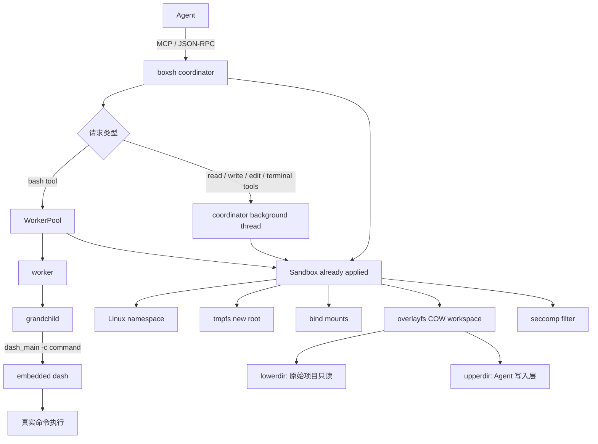
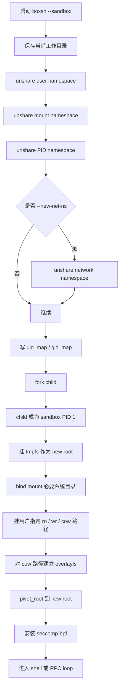
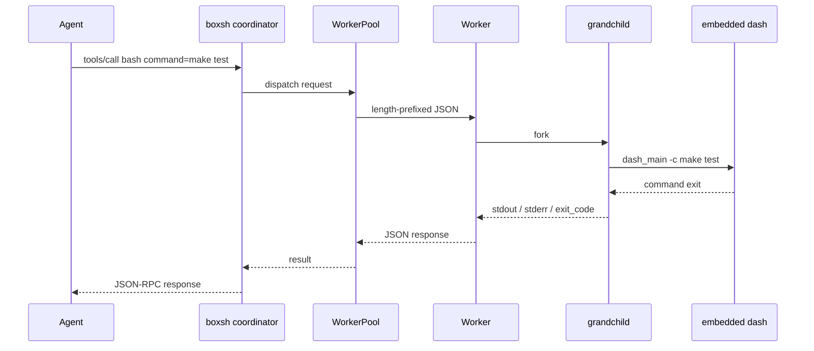

# 【学习】boxsh 项目学习

# 1. 摘要

boxsh 的定位是：它给 Agent 提供一个轻量级的受控的本地 shell 执行层。

普通的 shell 太自由。Agent 一旦能执行命令，就可能改坏工作区、读取不该读的文件、连到本机 socket、启动长时间任务，最后还只给上层返回一堆 terminal text。boxsh 要解决的是这组问题：让 Agent 能执行真实命令，但把执行范围、文件写入位置、返回结果都管起来。

## 术语表：

| 术语 | 概念理解 |
| --- | --- |
| tmpfs | 一种完全驻留在易失性内存（RAM）中的临时 filesystem，系统重启或卸载后内部数据即被擦除。 |
| bind mount | 将现有的目录树重新挂载到文件系统中的另一路径的操作，使两个不同的路径同时指向并操作同一底层的物理数据。 |
| overlayfs | 一种联合文件系统（UnionFS），能在不修改底层文件的情况下，将多个不同的目录按层级叠加，呈现为一个单一的目录结构。 |
| lowerdir | 在 overlayfs 中处于**底层的、只读状态的目录集合**，通常用于提供基础的系统库或不可变的镜像层。 |
| upperdir | 在 overlayfs 中处于**最上层的、可读写的目录**，所有对合并后文件系统的创建、修改和删除等增量物理修改均直接存储于此。 |
| workdir | **overlayfs 内部必需的临时工作目录**，**必须与 upperdir 同属一个底层 filesystem**，系统依靠它来确保文件移动到 upperdir 时的原子性（即操作不可中断，要么全部完成要么完全不发生）。 |
| merged view | **overlayfs 向上层用户态暴露的统一逻辑目录**，它将底层的 lowerdir 和顶层的 upperdir 的内容透明地合并在一起。 |
| COW | **(Copy-On-Write，写时复制)**：一种内存与存储管理优化策略，当多个调用者共享同一资源时，只有在某一方尝试修改该资源时，操作系统才会为其真正分配空间并复制一份独立的物理副本。 |
| copy-up | **overlayfs 执行写操作时的特定机制**，当用户首次尝试修改只读的 lowerdir 中的文件时，内核先将该文件完整复制到可写的 upperdir 中再执行修改。 |
| whiteout | 在 overlayfs 的 upperdir 中创建的一种特殊的字符设备文件或底层属性标记，用于在向上的视图中屏蔽底层的对应文件，以此在逻辑上表示该文件已被删除。 |
| namespace | Linux 内核提供的全局资源隔离特性，它对系统资源（如进程、网络等）进行抽象划分，使不同组的进程只能看到其所属隔离域内的资源视图。 |
| user namespace | 隔离安全标识符（即用户和用户组 ID）的机制，允许进程在该隔离域内部拥有特权（如 UID 0），但在系统全局范围内仅作为非特权进程存在。 |
| mount namespace | 隔离文件系统挂载点视图的机制，确保在此 namespace 内部进行的 mount 或 umount 操作不会影响到全局主机或其他隔离域。 |
| PID namespace | 隔离进程 ID（Process ID）分配空间的机制，使得隔离域内的首个进程拥有独立的 PID 1，实现局部进程树的管理。 |
| network namespace | 隔离网络协议栈（如物理或虚拟网卡接口、路由表、iptables 防火墙规则等）的机制，为内部进程提供完全独立的网络通信环境。 |
| pivot_root | 切换当前进程 mount namespace 根目录的系统调用，将根目录挂载点移动到新目录，并将旧根目录解耦并放置到指定路径下。 |
| seccomp-bpf | 基于 Berkeley Packet Filter（一种内核级的数据包过滤和指令匹配架构）的沙箱机制，用于细粒度地过滤和限制目标进程可以调用的具体系统调用（System Call）集合。 |

# 2. 总体逻辑

先看一张总图。它比堆文字更容易抓住 boxsh 的主线。



这张图里最重要的是两个事实。

第一，boxsh 先把 coordinator 放进 sandbox，再 fork workers。于是 shell 命令、文件工具、terminal 工具看到的是同一个受限世界。

第二，Agent 并不是直接控制一个裸 terminal。它通过 MCP / JSON-RPC 调工具，拿回结构化结果。`bash` tool 走 WorkerPool；`read`、`write`、`edit`、terminal 相关工具走 coordinator 的 background thread。

## 2.1 Linux sandbox 怎么组出来



这段逻辑不是在模拟容器，而是在直接调用 Linux kernel primitive。Docker 也使用这些 primitive，但 Docker 包装得更完整。boxsh 只拿 Agent 本地执行需要的那部分：隔离视图、可控文件写入、结构化工具接口。

## 2.2 overlayfs / tmpfs 在这条链路里分别干什么

```mermaid
flowchart LR
    subgraph Host[host filesystem]
        A[/repo 原始项目]
        B[/tmp/session/work 写入层]
        C[/tmp/session/.boxsh/work overlay 工作目录]
    end

    subgraph Sandbox[sandbox view]
        D[/tmp/session/work merged view]
        E[/ new root from tmpfs]
        F[/tmp from tmpfs]
    end

    A -->|lowerdir, read mostly| D
    B -->|upperdir, writes land here| D
    C -->|workdir, internal| D
    E --> Sandbox
    F --> Sandbox
```

`tmpfs` 负责干净和临时。boxsh 用它搭一个 new root，还给 sandbox 准备一个独立 `/tmp`。这样 sandbox 里的根目录不是 host 的真实根目录，临时文件也不会直接落到 host `/tmp`。

`overlayfs` 负责可写但不污染原始项目。Agent 在 merged view 里读写，看起来像普通目录。未修改的文件从 lowerdir 读；发生修改时 copy-up 到 upperdir；删除时 upperdir 记录 whiteout。原始项目留在 lowerdir，不被直接动。

可以把二者的分工记成一句话：tmpfs 搭临时世界，overlayfs 搭可丢弃的工作区。

## 2.3 Agent 请求怎么跑完



WorkerPool 的意义很直接：不要每次命令都重新搭执行框架。worker 预先 fork 好，收到命令后再 fork 一个 grandchild 去跑 dash。worker 负责收 stdout、stderr、exit code、duration，也负责 timeout 和输出上限。

这里还有一个容易误会的点：MCP 工具名叫 `bash`，不代表它执行 Bash 语法。当前源码里真正跑的是 embedded dash。所以给 boxsh 的命令最好按 POSIX sh 写，不要默认用 Bash-only 写法。

# 3. 总结

boxsh 的主线可以压成一句话：用 Linux / macOS 的原生隔离能力包住一个 shell，再把它做成 Agent 可以调用的结构化工具。

在 Linux 上，隔离靠 namespace、mount、pivot_root、seccomp；临时根目录靠 tmpfs；可写但不污染原始项目靠 overlayfs COW；命令解释靠 embedded dash；Agent 协作靠 MCP / JSON-RPC；并发和稳定性靠 WorkerPool。

真正值得读的源码路径还是这四个：

```
src/main.cpp
  -> src/sandbox.cpp
  -> src/worker_pool.cpp
  -> src/rpc.cpp
```

读 `main.cpp` 是为了看启动分岔；读 `sandbox.cpp` 是为了看 Linux kernel 特性怎么被组合成 sandbox；读 `worker_pool.cpp` 是为了看命令怎么被执行和回收；读 `rpc.cpp` 是为了看 Agent 请求怎么被拆成工具调用。