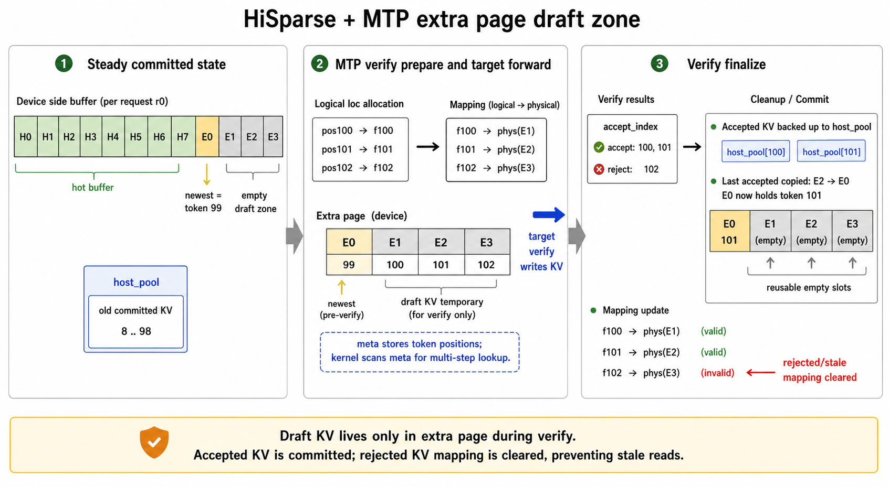

# 【工程】hiSparse + MTP 实现

# **摘要**

主线分 6 段：启动校验 → prefill → HiSparse staging → decode batch 重建
→ MTP draft/verify → accepted KV finalize。



### 1. 启动阶段：确认组合合法，建 HiSparse 管理器

```
ServerArgs.validate
→ ModelRunnerKVCacheMixin.init_memory_pool
→ ModelRunner init path
→ HiSparseCoordinator.__init__
→ ModelRunner.init_attention_backend
```

| 函数 | 作用 |
| --- | --- |
| `ServerArgs.validate` | 拒绝非法配置：draft tokens 不能超过 extra page 容量；`topk > 1 && page_size > 1` 直接报错。 |
| `init_memory_pool` | 普通 KV allocator 被包成 `HiSparseTokenToKVPoolAllocator`，形成 logical loc 与 physical HiSparse slot 的双层映射。 |
| `HiSparseCoordinator.__init__` | 建 HiSparse 全局状态：device buffer、host pool、LRU slots、token metadata、异步 stream。 |
| `init_attention_backend` | DSA attention backend 拿到 `hisparse_coordinator`，后续 attention 可走 HiSparse 查 KV。 |

核心状态：

```
req_to_device_buffer              req → physical HiSparse slots
req_device_buffer_tokens          slot 当前代表哪个 token position
req_device_buffer_token_locs      slot → physical KV loc
req_to_host_pool                  token position → host KV loc
full_to_hisparse_device_mapping   logical loc → physical HiSparse slot
```

---

### 2. prefill 阶段：target 先跑，再准备 draft 初始状态

```
Scheduler.run_batch
→ EAGLEWorkerV2.forward_batch_generation
→ target_worker.forward_batch_generation
→ EagleDraftWorker._draft_extend_for_prefill
```

| 函数 | 作用 |
| --- | --- |
| `EAGLEWorkerV2.forward_batch_generation` | 如果 batch 是 extend/prefill，就先跑 target model。 |
| `target_worker.forward_batch_generation` | 正常 target prefill，产生首 token、hidden states、KV。 |
| `_draft_extend_for_prefill` | 用 target hidden states + next token 跑 draft model，填 draft KV，并产出下一轮 `EagleDraftInput`。 |

`EagleDraftInput` 里保存：

```
bonus_tokens    target prefill 产出的 token
hidden_states   给 draft model 下一步用
topk_p/index    draft 下一轮起点
```

---

### 3. HiSparse staging：prefill KV 先搬到 host，再进入 decode

```
SchedulerBatchResultProcessor.process_batch_result_prefill
→ _stash_hisparse_spec_info
→ HiSparseCoordinator.admit_request_into_staging
→ HiSparseCoordinator.collect_ready_reqs
→ Scheduler._build_hisparse_decode_batch
```

| 函数 | 作用 |
| --- | --- |
| `process_batch_result_prefill` | prefill 结束后，把 req 从 prefill 阶段转入 decode/staging。 |
| `_stash_hisparse_spec_info` | 把 batch 级 spec state 切成 per-req state，挂到 `req.hisparse_spec_info`。 |
| `admit_request_into_staging` | 把 prefill 期间在 GPU 上的 KV 异步 backup 到 host pool。 |
| `collect_ready_reqs` | 轮询 backup event，完成后给 req 分配 HiSparse device buffer。 |
| `_build_hisparse_decode_batch` | staging 完成后重新拼 decode batch，并把 per-req spec state merge 回 batch。 |

为什么要 stash？

HiSparse prefill→decode 不是普通 `last_batch` merge。

prefill KV 要先进 host，再从 staging queue 回来。

如果不 stash，MTP 的 `topk_p/topk_index/hidden_states/bonus_tokens`
会在这个断点丢掉。

---

### 4. decode 前准备：为本轮 MTP 预分配 logical loc 与 extra-page slot

```
Scheduler.update_running_batch
→ ScheduleBatch.prepare_for_decode
→ EagleDraftInputV2Mixin.prepare_for_decode
→ HiSparseCoordinator.get_draft_device_slots_variable
→ HiSparseTokenToKVPoolAllocator.alloc_extend_with_device_mapping
```

| 函数 | 作用 |
| --- | --- |
| `update_running_batch` | 每轮 decode 前过滤完成请求，准备下一轮 batch。 |
| `ScheduleBatch.prepare_for_decode` | spec_v2 下把 decode 准备交给 `batch.spec_info.prepare_for_decode`。 |
| `EagleDraftInputV2Mixin.prepare_for_decode` | 计算每个 req 本轮需要多少 KV slot，更新 `kv_allocated_len / kv_committed_len`。 |
| `get_draft_device_slots_variable` | 从每个 req 的 HiSparse extra page 里取 physical slots。 |
| `alloc_extend_with_device_mapping` | 分配 logical KV loc，并把它们映射到上一步给定的 physical HiSparse slots。 |

这里是 PR 的第一处核心改动：

原来 MTP 只会从 paged allocator 拿普通 KV page。

现在逻辑 loc 仍然分配，但 physical KV 不走普通 page，而是绑定到 HiSparse extra page。

---

### 5. draft 阶段：draft model 生成候选 token 树

```
EAGLEWorkerV2.forward_batch_generation
→ EagleDraftWorker.draft
→ EagleDraftInput.prepare_for_v2_draft
→ EagleDraftWorker.draft_forward
→ build_tree_kernel_efficient
```

| 函数 | 作用 |
| --- | --- |
| `EAGLEWorkerV2.forward_batch_generation` | decode 分支：先跑 draft，再跑 target verify。 |
| `EagleDraftWorker.draft` | draft model 入口。 |
| `prepare_for_v2_draft` | 构造 draft model 的 `ForwardBatch`，准备 positions、cache loc、CUDA graph 条件。 |
| `draft_forward` | 多步 draft forward，产生多 token 候选。 |
| `build_tree_kernel_efficient` | 把 draft 候选整理成 tree mask、retrieve index、draft tokens，交给 target verify。 |

这一段主要是 MTP/EAGLE 原有逻辑。

---

### 6. target verify：绑定 verify token 到 HiSparse extra page

```
EAGLEWorkerV2.verify
→ EagleVerifyInputV2Mixin.prepare_for_v2_verify
→ HiSparseCoordinator.prepare_verify_slots_spec_v2
→ target_worker.forward_batch_generation
→ DeepseekSparseAttnBackend.forward
→ HiSparseCoordinator.swap_in_selected_pages
→ hisparse.cuh::load_cache_to_device_buffer_kernel
```

| 函数 | 作用 |
| --- | --- |
| `EAGLEWorkerV2.verify` | target verify 入口。 |
| `prepare_for_v2_verify` | 给 verify tokens 生成 `verify_cache_locs`，并构造 target `ForwardBatch`。 |
| `prepare_verify_slots_spec_v2` | 把 `verify_cache_locs` 绑定到 extra-page physical slots，并写 token position metadata。 |
| `target_worker.forward_batch_generation` | target model 对 draft tokens 做验证 forward。 |
| `DeepseekSparseAttnBackend.forward` | DSA attention 实际读 KV。target verify 下不能普通 translate，必须 HiSparse swap-in。 |
| `swap_in_selected_pages` | 把 top-k token position 转成 physical device loc，必要时从 host swap in。 |
| `load_cache_to_device_buffer_kernel` | CUDA kernel：查 hot buffer / extra page / host cache，返回真正可读的 KV loc。 |

kernel 关键函数：

| 函数 | 作用 |
| --- | --- |
| `try_get_static_device_loc` | token 还在 hot buffer 内，直接按 token index 找 physical loc。 |
| `try_get_extra_page_device_loc` | token 是 draft/newest token 时，不再把 token_idx 当 slot idx，而是查 `req_device_buffer_tokens` metadata。 |
| `load_cache_to_device_buffer_kernel` | 每个 block 处理一个 req；多 step 循环；维护 LRU；miss 时从 host 拷回 device。 |

这里解决旧 bug：

```
旧逻辑：
token_idx ≈ slot_idx
→ 长 prompt / repeated output 后容易读 stale draft KV

新逻辑：
token_idx → req_device_buffer_tokens metadata lookup → physical slot
→ token 与 slot 解耦
```

---

### 7. sample / accept 后：提交 accepted KV，清掉 rejected KV

```
EagleVerifyInputV2Mixin.sample
→ EAGLEWorkerV2.verify
→ HiSparseCoordinator.finalize_accepted_tokens_spec_v2
→ HiSparseCoordinator.finalize_accepted_tokens
→ EagleDraftWorker._draft_extend_for_decode
```

| 函数 | 作用 |
| --- | --- |
| `sample` | 根据 target logits 与 draft logits 算 `accept_index / accept_lens / predict`。 |
| `finalize_accepted_tokens_spec_v2` | 以 `accept_index` 为唯一输入，算每个 req 接受了哪些 verify slots。 |
| `finalize_accepted_tokens` | 清理 rejected mapping；accepted KV 若超 hot buffer 则 backup 到 host；最后 accepted token 复制到 newest slot。 |
| `_draft_extend_for_decode` | 用 accepted tokens 更新 draft model KV，产出下一轮 `EagleDraftInput`。 |

`finalize_accepted_tokens` 做三件事：

```
1. rejected draft logical loc → mapping 清零
2. accepted token:
   - 在 hot buffer 内 → logical loc 映射到 hot slot
   - 超出 hot buffer → KV backup 到 host pool
3. 每个 req 最后 accepted token → newest slot
```

为什么要 newest slot？

下一轮 decode 的最新 token 最常被 attention 读到。

放到固定 `device_buffer_size` 位置，HiSparse 查找和 backup 都更简单。

---

### 8. 收尾释放：避免 double free 与 stale mapping

```
HiSparseCoordinator.request_finished
→ token_to_kv_pool_allocator.free_hisparse_indices
→ clear req metadata
```

| 函数 | 作用 |
| --- | --- |
| `request_finished` | req 完成后释放 side buffer、host KV、mapping、LRU metadata。 |
| `free_hisparse_indices` | 只释放实际 physical HiSparse slots。 |
| `restore_state` | 对 draft extra-page mapping 做特殊保留，避免 allocator rollback 把 verify 所需 mapping 清掉。 |